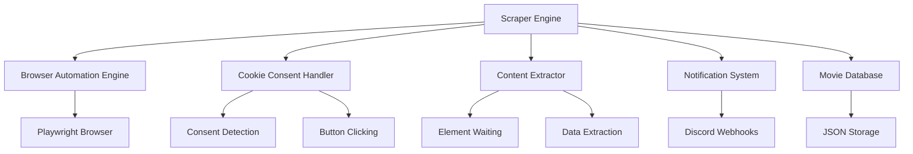

# Design Document: Browser Automation Scraper

## Overview

The browser-automation-scraper upgrades an existing Python web scraper from simple HTTP requests (aiohttp) to browser automation using Playwright. This enables handling of cookie consent dialogs and JavaScript-rendered content while maintaining compatibility with existing database structures and notification systems.

The design leverages Playwright's modern async API, robust element waiting mechanisms, and cross-browser support to create a reliable scraper that can handle dynamic web content. The architecture maintains the existing async/await patterns and integrates seamlessly with the current Discord notification and JSON database systems.

## Architecture

The system follows a modular architecture with clear separation of concerns:



**Key Architectural Decisions:**

1. **Playwright over Selenium**: Chosen for superior async support, faster execution, modern API, and better handling of dynamic content
2. **Headless Operation**: Default headless mode for resource efficiency while maintaining option for debugging
3. **Modular Components**: Each major function (consent handling, extraction, etc.) is isolated for maintainability
4. **Async/Await Preservation**: Maintains existing async patterns for compatibility with current codebase

## Components and Interfaces

### Browser Automation Engine

**Purpose**: Manages Playwright browser lifecycle and provides core automation capabilities.

**Key Methods:**
- `async def initialize_browser() -> Browser`: Creates and configures browser instance
- `async def create_context() -> BrowserContext`: Creates isolated browser context with appropriate settings
- `async def navigate_to_page(url: str) -> Page`: Navigates to target URL with proper error handling
- `async def cleanup() -> None`: Properly closes browser resources

**Configuration:**
- Headless mode enabled by default
- User agent rotation for anti-detection
- Reasonable timeouts (30s page load, 10s element wait)
- Resource blocking for images/fonts to improve performance

### Cookie Consent Handler

**Purpose**: Detects and automatically handles cookie consent dialogs using common patterns.

**Key Methods:**
- `async def detect_consent_dialog(page: Page) -> bool`: Checks for presence of consent dialogs
- `async def handle_consent(page: Page) -> ConsentResult`: Attempts to accept cookies using known selectors
- `async def wait_for_consent_completion(page: Page) -> None`: Waits for dialog dismissal

**Consent Detection Strategy:**
Based on research, the handler uses a prioritized list of CSS selectors for common consent management platforms:

1. **CookieBot**: `#CybotCookiebotDialogBodyLevelButtonLevelOptinAllowAll`
2. **OneTrust**: `#onetrust-accept-btn-handler`
3. **Cookieyes**: `.cky-btn-accept`
4. **Generic Swedish**: `button:contains("Godkänn alla kakor")`
5. **Generic Accept**: `button:contains("Accept all"), button:contains("Acceptera alla")`
6. **Fallback**: `[data-testid*="accept"], [id*="accept"], [class*="accept"]`

### Content Extractor

**Purpose**: Extracts movie information from JavaScript-rendered pages using robust waiting strategies.

**Key Methods:**
- `async def wait_for_content_load(page: Page) -> None`: Waits for dynamic content to fully render
- `async def extract_movie_data(page: Page) -> MovieData`: Extracts all required movie information
- `async def validate_extracted_data(data: MovieData) -> ValidationResult`: Ensures data completeness

**Extraction Strategy:**
- Uses Playwright's `wait_for_selector()` with intelligent timeouts
- Implements fallback selectors for each data field
- Validates extracted data before returning
- Takes screenshots on extraction failures for debugging

### Data Models

**MovieData Structure** (maintains compatibility with existing format):
```python
@dataclass
class MovieData:
    title: str
    date: str
    time: str
    location: str
    booking_url: str
    extracted_at: datetime
    source_url: str
```

**ConsentResult Structure**:
```python
@dataclass
class ConsentResult:
    success: bool
    method_used: str
    error_message: Optional[str]
    screenshot_path: Optional[str]
```

**ScrapingResult Structure**:
```python
@dataclass
class ScrapingResult:
    success: bool
    movie_data: Optional[MovieData]
    consent_result: ConsentResult
    extraction_errors: List[str]
    performance_metrics: Dict[str, float]
```

## Correctness Properties

*A property is a characteristic or behavior that should hold true across all valid executions of a system—essentially, a formal statement about what the system should do. Properties serve as the bridge between human-readable specifications and machine-verifiable correctness guarantees.*

### Property 1: Browser Resource Management
*For any* scraping session, when the session completes (successfully or with errors), all browser processes and resources should be properly cleaned up and no zombie processes should remain.
**Validates: Requirements 1.3, 6.2**

### Property 2: Cookie Consent Detection and Handling
*For any* page with a cookie consent dialog, the consent handler should detect the dialog and successfully click the appropriate accept button, resulting in the dialog being dismissed.
**Validates: Requirements 2.1, 2.2, 2.3**

### Property 3: Complete Movie Data Extraction
*For any* valid movie page with all required fields present, the content extractor should successfully extract all movie information (title, date, time, location, booking URL) and return it in the correct MovieData format.
**Validates: Requirements 3.1, 3.2, 3.3, 3.4, 3.5**

### Property 4: Partial Data Handling
*For any* movie page with missing or incomplete information, the content extractor should extract whatever fields are available, log the missing fields, and return partial data rather than failing completely.
**Validates: Requirements 3.6, 5.4**

### Property 5: Database Format Compatibility
*For any* extracted movie data, when stored to the database, the JSON structure should match exactly the format used by the existing scraper, preserving all field names, types, and file paths.
**Validates: Requirements 4.1, 4.3, 4.4**

### Property 6: Notification System Compatibility
*For any* new movie information discovered, the notification system should send Discord webhook notifications using the same URLs, message format, and data structure as the existing implementation.
**Validates: Requirements 4.2, 4.5**

### Property 7: Error Handling and Retry Consistency
*For any* browser automation error or network timeout, the scraper should implement the same retry logic, attempt counts, and backoff patterns as the existing aiohttp-based scraper.
**Validates: Requirements 5.1, 5.2**

### Property 8: Comprehensive Error Logging
*For any* scraping failure (page load, consent handling, or extraction), the system should log detailed error information including error messages, stack traces, and screenshots when possible, maintaining the same logging format as the existing implementation.
**Validates: Requirements 2.5, 5.3, 5.5**

### Property 9: Timeout and Performance Management
*For any* scraping operation, the system should respect configured timeouts for page loading and element detection, and should not hang indefinitely or consume excessive resources.
**Validates: Requirements 6.3, 6.4, 6.5**

## Error Handling

The system implements comprehensive error handling at multiple levels:

### Browser-Level Errors
- **Browser Launch Failures**: Retry with exponential backoff, fallback to different browser configurations
- **Page Navigation Errors**: Log detailed error information, attempt retry with fresh browser context
- **Element Interaction Failures**: Screenshot capture, detailed selector logging, graceful degradation

### Content Extraction Errors
- **Missing Elements**: Log missing selectors, attempt fallback selectors, return partial data
- **Parsing Errors**: Log raw content for debugging, attempt alternative parsing strategies
- **Validation Failures**: Log validation errors, save partial data with error flags

### System Integration Errors
- **Database Write Failures**: Retry with exponential backoff, maintain data integrity
- **Notification Failures**: Queue notifications for retry, log webhook errors
- **Resource Cleanup Failures**: Force cleanup with system calls, log resource leaks

### Error Recovery Strategies
1. **Graceful Degradation**: Continue operation with reduced functionality when possible
2. **Retry with Backoff**: Implement exponential backoff for transient failures
3. **Circuit Breaker**: Temporarily disable failing components to prevent cascade failures
4. **Detailed Logging**: Capture comprehensive error context for debugging

## Testing Strategy

The testing approach combines unit tests for specific scenarios with property-based tests for comprehensive validation:

### Unit Testing Focus
- **Specific Examples**: Test known consent dialog formats and movie page structures
- **Edge Cases**: Handle malformed pages, network timeouts, and missing elements
- **Integration Points**: Verify database writes, Discord notifications, and configuration loading
- **Error Conditions**: Test specific failure scenarios and recovery mechanisms

### Property-Based Testing Configuration
- **Library**: Use Hypothesis for Python property-based testing
- **Test Iterations**: Minimum 100 iterations per property test for thorough coverage
- **Data Generation**: Generate varied page structures, consent dialogs, and error conditions
- **Property Validation**: Each correctness property implemented as a single property-based test

### Test Data Strategy
- **Mock Pages**: Create HTML templates representing different movie page layouts
- **Consent Dialog Variations**: Test multiple consent management platform implementations
- **Error Simulation**: Inject network failures, timeouts, and malformed responses
- **Performance Testing**: Measure resource usage and cleanup effectiveness

### Property Test Tags
Each property-based test will be tagged with:
**Feature: browser-automation-scraper, Property {number}: {property_text}**

Example:
```python
@given(movie_page_html=movie_page_strategy())
def test_complete_movie_data_extraction(movie_page_html):
    """Feature: browser-automation-scraper, Property 3: Complete Movie Data Extraction"""
    # Test implementation
```

### Continuous Integration
- **Automated Testing**: Run full test suite on every commit
- **Browser Compatibility**: Test across different browser versions and configurations
- **Performance Monitoring**: Track resource usage and execution time trends
- **Regression Detection**: Maintain baseline performance and functionality metrics